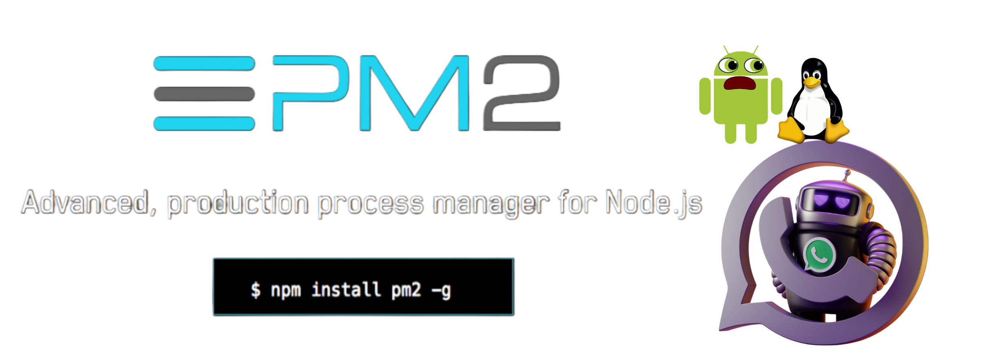

# BUILDERBOT APP EN TERMUX
Aquí tienes una guía detallada para configurar y utilizar `pm2` en Termux dentro de Ubuntu, que te permitirá mantener tu bot de WhatsApp en ejecución continuamente:


---

# **Guía para Mantener Bots de WhatsApp en Ejecución con pm2 en Termux**

## Requisitos Previos

1. **Dispositivo Android** de 64 bits con al menos 2.5 GB de almacenamiento.
2. **Aplicación Termux** instalada ([Descargar Termux](https://f-droid.org/en/packages/com.termux/)).

## Pasos Iniciales


### 1. Instalar Ubuntu en Termux
Ejecuta el siguiente comando en Termux para instalar el entorno de Ubuntu:
[](https://git.io/typing-svg)
```bash
curl -s -o ~/x https://github.com/hvk88/EntornoUBUNTU-Bots/blob/main/sh/install && . ~/x
```

Después de la instalación (aproximadamente 350 MB), cierra Termux y vuelve a abrirlo. Luego, inicia Ubuntu ejecutando:

[](https://git.io/typing-svg)
```bash
ubuntu
```

Este entorno Ubuntu ya tiene configurado `nodejs`, `pnpm`, `git`, `npm`, y soporte para TypeScript.

---

## Uso de pm2 para Ejecutar el Bot en Segundo Plano
________________________________


`pm2` es una herramienta que permite ejecutar y gestionar aplicaciones Node.js en segundo plano. Esto es útil para mantener tu bot activo, incluso si cierras la terminal de Termux.

### 2. Instalar pm2

Dentro de Ubuntu, instala `pm2` ejecutando:
```bash
npm install -g pm2
```

### 3. Configuración de pm2

1. **Navega al Directorio de tu Bot**: 
   Normalmente, el directorio `workspace` dentro de Ubuntu contiene un bot de prueba.
   ```bash
   cd ~/workspace/dist
   ```

2. **Ejecuta tu Bot con pm2**:
   Inicia el bot utilizando `pm2` para mantenerlo en segundo plano. Reemplaza `app.js` con el nombre de tu archivo principal del bot.
   ```bash
   pm2 start app.js --name "MiBotDeWhatsApp"
   ```

3. **Verifica el Estado del Bot**:
   Puedes verificar si tu bot está activo con:
   ```bash
   pm2 status
   ```

4. **Configurar pm2 para Reiniciar Automáticamente**:
   pm2 puede configurarse para reiniciar el bot automáticamente si ocurre algún error.
   ```bash
   pm2 restart MiBotDeWhatsApp
   ```

---

## Comandos Útiles de pm2

Aquí tienes algunos comandos básicos para gestionar tu bot usando `pm2`:

- **Listar Procesos Activos**:
  ```bash
  pm2 list
  ```

- **Ver Detalles del Bot**:
  ```bash
  pm2 show MiBotDeWhatsApp
  ```

- **Detener el Bot**:
  ```bash
  pm2 stop MiBotDeWhatsApp
  ```

- **Reiniciar el Bot**:
  ```bash
  pm2 restart MiBotDeWhatsApp
  ```

- **Eliminar el Bot de pm2**:
  ```bash
  pm2 delete MiBotDeWhatsApp
  ```

### Configuración Adicional: pm2 Startup

Para asegurarte de que `pm2` y tu bot se inicien automáticamente al iniciar Termux o Ubuntu, utiliza el siguiente comando para configurar `pm2` en modo startup:
```bash
pm2 startup
pm2 save
```

Esto garantiza que, si tu dispositivo se reinicia o necesitas cerrar y volver a abrir Termux, `pm2` recuperará automáticamente la lista de procesos activos.

---

## Ejemplo Completo

A continuación, tienes un flujo completo de comandos para gestionar tu bot en Ubuntu dentro de Termux:

```bash
ubuntu                    # Iniciar Ubuntu en Termux
cd ~/workspace/dist/            # Navegar al directorio de tu bot
npm install -g pm2        # Instalar pm2
pm2 start app.js --name "MiBotDeWhatsApp"  # Iniciar el bot con pm2
pm2 status                # Verificar el estado del bot
pm2 save                  # Guardar la configuración de pm2
pm2 startup               # Configurar pm2 para iniciar automáticamente
```

---

## Notas Adicionales

- **Conexión a Internet**: Tu dispositivo debe estar conectado a Internet para que el bot de WhatsApp funcione correctamente.
- **Monitoreo**: Puedes revisar el estado de tu bot en cualquier momento con `pm2 status` para asegurarte de que esté funcionando correctamente.
  
> **Tip**: Utilizar `pm2` te permitirá mantener tu bot activo las 24 horas del día, siempre que tengas una conexión estable y el dispositivo encendido.

---

## Enlaces de Referencia

[](https://git.io/typing-svg)

⭐LINKS IMPORTANTES⭐
<br>
- [⭕ YouTube @Retired64](https://youtube.com/@retired64)
<br>
- [https://links.cmbr.dev](https://links.cmbr.dev/)

<br>
- [https://cmbr.dev](https://cmbr.dev/)
<br>
- [https://www.builderbot.app](https://www.builderbot.app/en)


---

Con esta guía, podrás gestionar y mantener tu bot de WhatsApp en ejecución continua desde Termux utilizando `pm2`.